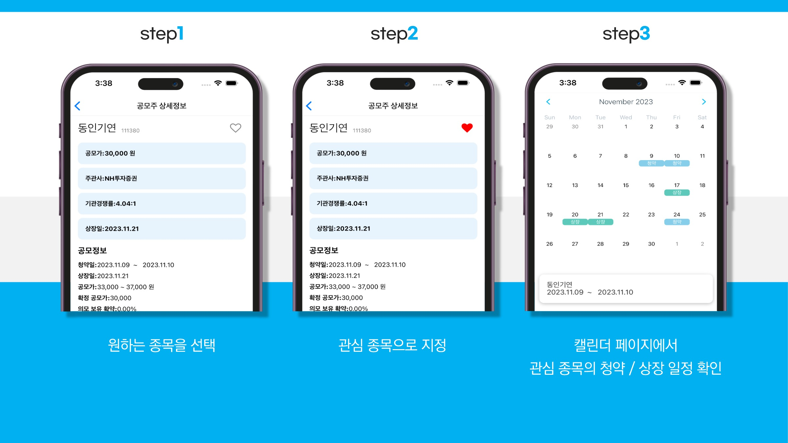
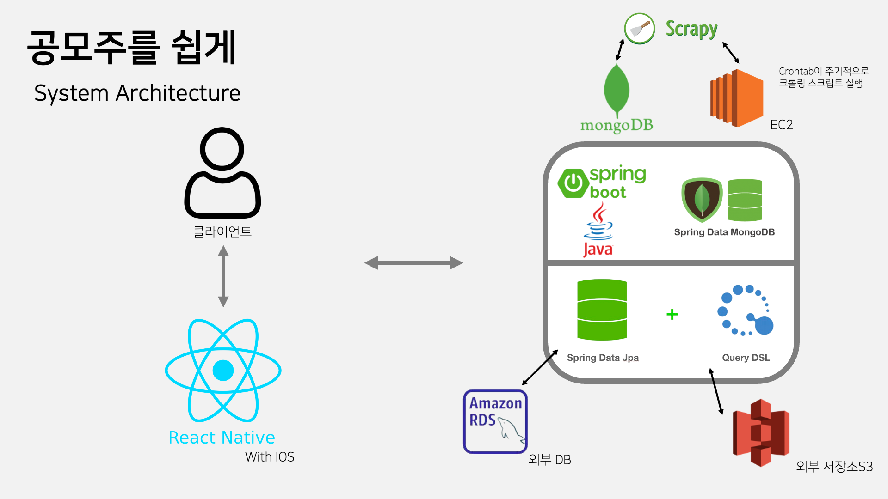
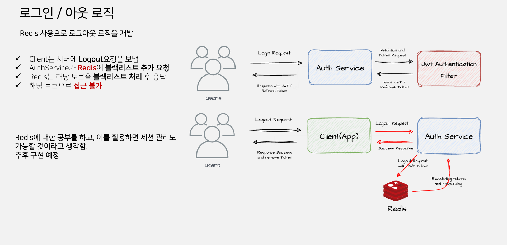
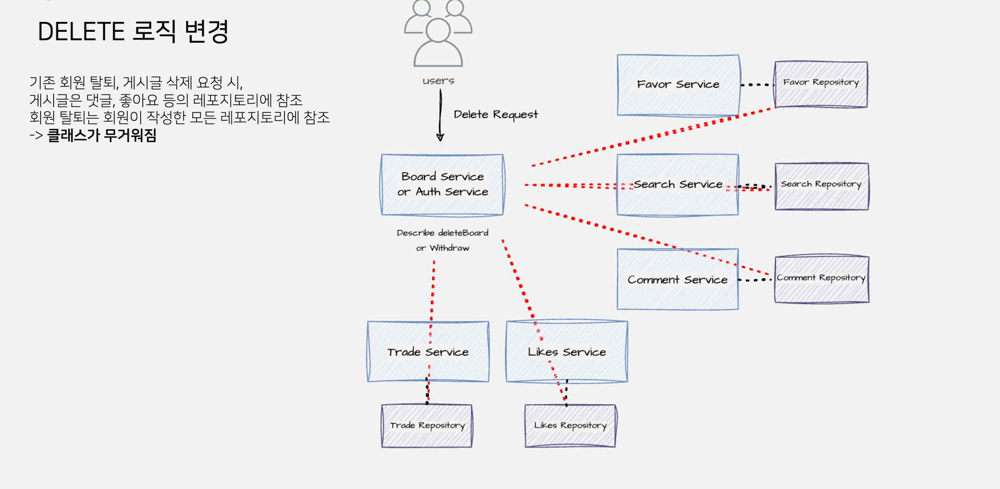
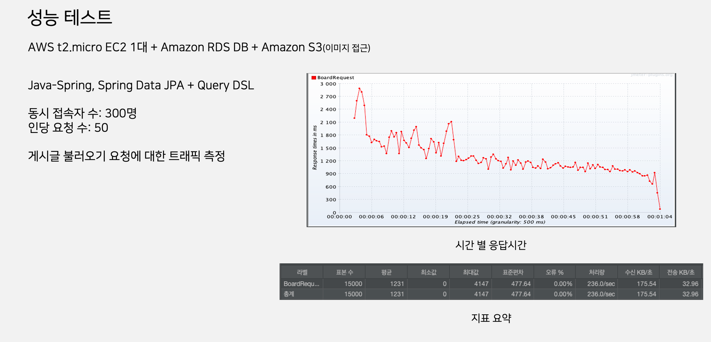
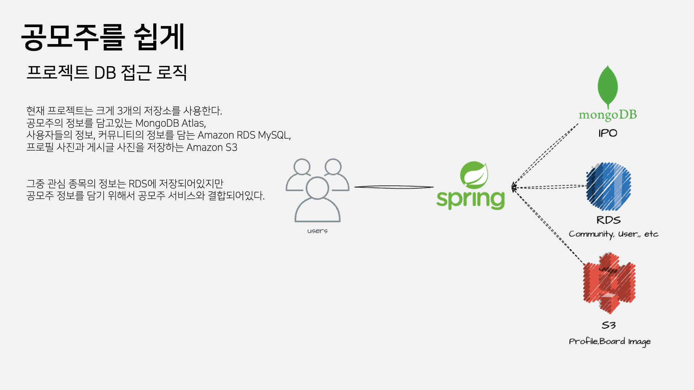

# 공모주 정보 제공 앱 서비스

   
  
  
  
  
  
  

   

## 프로젝트 소개

프로젝트 개요/동기

- 알아야할 것이 많은 공모주를 신발을 응모하듯 쉽게 접근할 수 있게끔 정보를 제공하는 서비스를 기획하게됨
- 공모주의 정보를 쉽게 정리해주는 앱 서비스
- 공모주 상세 정보, 일정 캘린더, 매매 일지, 관심 종목 등의 기능 제공

 

## 기술 스택

### Tools

|Java | Spring Boot | MongoDB  |  MySQL   | Scrapy |
| :--------: | :--------: | :--------: | :------: | :-----: |
|   ![java]   | ![spring]   | ![mongo] | ![mysql] |![scrapy]|

### etc
|Amazon EC2 | Amazon RDS |  Amazon S3 |
| :--------: | :--------: | :------: | 
|   ![ec2]    |   ![rds]    | ![s3] | 

 

## 구현 기능

### 크롤링 자동화 서버 구축
- Crontab과 ScrapyCrawler를 활용
### 공모주 DB 구축
- MongoDB Atlas 사용
### 회원 탈퇴, 게시글 삭제 로직 개편
- 단일 책임 원칙 적용
### 좋아요 로직을 변형한 관심종목 로직 개발

 

## 성능 최적화 및 개선 전략

### 공모주 DB 구성

### 로그아웃 로직

### 삭제 로직 개선안 및 구현

### 성능 체크(Jmeter)

### MSA구조 제안

 

## 회고
- 첫 팀 프로젝트, Discord - Notion - Github을 통한 협업에 의미가 있었다.
- 협업이란 것이 어떤 부분이 어려운지 많이 느꼈던 프로젝트이고, 많이 배웠다고 생각한다.
- MongoDB와 RDS MySQL을 같이 사용함에 있어서 로직의 복잡함과 응답속도 저하를 확인 -> 공모주 정보만을 다루는 하나의 서버와 클라이언트 정보만을 다루는 하나의 서버로 분리하는 아이디어 제시
- 추후 위 기능을 개선하기위한 MSA구조를 제안, 및 개발해볼 예정

 

## 개발일정

개발 일정

### 2023-08-23
- 요구사항 정리 및 프로젝트 개요 설정
- api명세 / DTO 정리

### 2023-08-28
- Scrapy 활용한 크롤링/MongoDB에 저장하는 로직 개발

### 2023-08-29
- 로그인 과정 구현 (Back)
  JWT/RefreshToken을 이용한 보안 / *추후 카카오|구글 로그인 서비스 추가 계획
- dto <-> entity간 전환(ModelMapper)로직 개발 (Back)
- 테스트 DB 구축 및 테스트 완료 (Back)

### 2023-08-30
- ~~크롤링 방식 변경 고려 *공모주 정보 제공 사이트의 xpath 좌표 상이로 취소~~
- 초보자를 위한 서비스로 타깃 변경

### 2023-09-04
- 회원가입/로그인 컨트롤러 구현 (Back)

### 2023-09-06
- 조회수 증가 로직 구현 (Back)
- 게시글 불러오기 로직 구현 (Back)

### 2023-09-10
- 크롤링 방식 변경 ~~*기존엔 한 페이지 전체 -> 하나씩(안정성을 위함)~~
- 크롤링 데이터 -> mongoDB 적재 구현
- 공모주 관련 로직 구현 (Back)

### 2023-09-12
- 크롤링 최적화
- mongoDB <-> Spring 연동 완료 (Back)
- 커뮤니티 게시글 기능 구현 (Back)*게시글 사진의 경우 추후에 협의 후 타입 및 방식 수정 예정

### 2023-09-13
- 마이페이지 로직 구현 (Back)
- 회원정보 수정 로직 구현 (Back)

### 2023-09-18
- 매매일지 구성 (Back)
- DB 구축

### 2023-09-20
- 매매일지 로직 구현중 (Back)
- 크롤링 ec2에서 주기적으로 실행하기 구현

### 2023-09-22
- 매매일지 로직 구현 완료 (Back)

### 2023-09-25
- 댓글 로직 추가 (Back)
- 게시글, 댓글 수정 로직 추가 (Back)

### 2023-09-27
- 크롤링 업데이트 기능 추가
- 여러 요소 크롤링 구현중

### 2023-10-02
- 좋아요 로직 추가 (Back)
- 임시 서버 배포 및 환경 구축
- ec2, rds, s3

### 2023-10-03
- 관심종목 로직 추가 (Back)
- 검색 로직 구현중 (Back)

### 2023-10-05
- 검색 로직 구현 완료(Back)

### 2023-10-10
- 크롤링 업데이트, 가져오기 자동화 완료
- 2차 임시 서버 배포

### 2023-10-13
- 로그아웃 로직 구현 *redis (Back)

### 2023-10-16
- 좋아요 개수 가져오기 구현 *사용자 경험을 위함 (Back)

### 2023-10-23
- 삭제 로직 개편 (Back)

### 2023-11-06
- 수정 로직 개편 (Back)
- 좋아요 고유값으로 수정 (Back)

### 2023-11-13
- QueryDsl 도입

### 2023-12-01
- DeleteApplication 제안 및 개발

<!-- Stack Icon Refernces -->

[java]: /images/stack/java.png
[mongo]: /images/stack/mongodb.png
[spring]: /images/stack/springboot.png
[scrapy]: /images/stack/scrapy.png
[mysql]: /images/stack/rds_mysql.png
[ec2]: /images/stack/ec2.png
[rds]: /images/stack/rds.png
[s3]: /images/stack/s3.png
